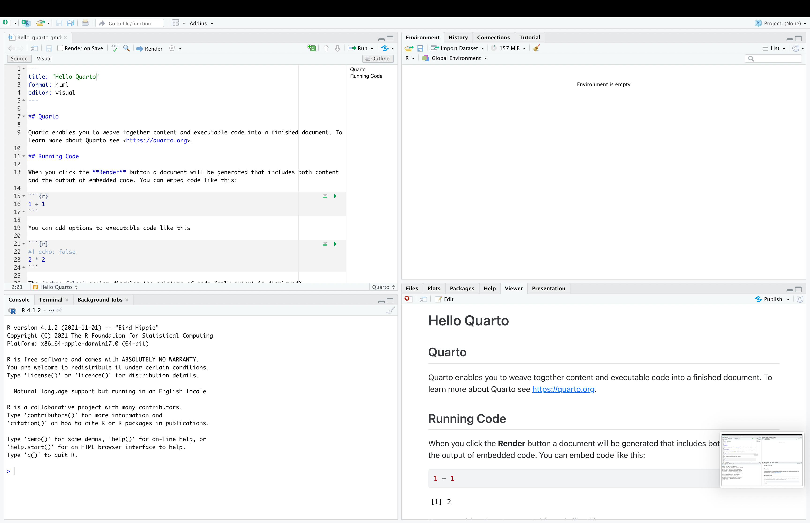

# Learning goals

The purpose of this notebook is to show case the use of `Quarto` notebooks. It will cover:

-   Brief introduction to Quarto Notebooks

-   Running R with Quarto Notebooks

-   Running Python with Quarto Notebooks + `reticulate`

See [Quarto's website](https://quarto.org/) for a more in-depth coverage of the framework.

# Intro to Quarto

Quarto is the **next-generation version of R Markdown**. If you're an R Markdown user, you will see how Quarto is just an extension of the capabilities that were previously provided by R Markdown. Now, instead of `.rmd` files, we have `.qmd` files.

As in R Markdown, Quarto is **an unified authoring framework**. It combines **code, results, and text**. These combinations can be rendered as PDFs, Word Files, HTMLs, and more. Quarto use case. Quarto use cases include:

-   Technical reports that demonstrate or utilize the features of a current code base.
-   Slide decks that provide an overview of up-to-date data and are generated on a regular basis.
-   Sharing exploratory or prototype analyses with co-authors or collaborators. Writing blogs for blogging platforms that accept .md files (markdown format).
-   Authoring websites, like our course website.


# Installing

Quarto is the notebook framework for Rstudio. That being said, you can also use Quarto inside of JupyterLab, but that seems absolutely inefficient for me.

To use Quarto, you should then just install RStudio:

-   [RStudio](https://posit.co/download/rstudio-desktop/)

## Quick tutorial for RStudio

This is what RStudio looks like when you open it for the first time.

```{r}
#| echo: false

```

**Top left pane (input/script)**

This is your code editor. Here you enter code in any file type (.py, .r, .qmd) you are working on. If not working with notebooks, this is just gonna be a plain text file but with a extension that run the commands.

For example, enter `2 + 2` in your script and run a line of code by pressing `command + enter` (Mac) or `Ctrl + enter` (PC). This is a huge advantage of Rstudio over Jupyter. You can run your code line by line, instead of running the entire cell.

**Bottom left pane (output/console)**

This is the console. It is pretty much like when you open Python/R from the Command line.

In the console, the prompt `>` looks like a greater than symbol. If your prompt begins to look like a `+` symbol by mistake, simply click in your console and press the `esc` key on your keyboard as many times as necessary to return to the prompt.

Rstudio uses `+` when code is broken up across multiple lines and is still expecting more code. A line of code does not usually end until Rstudio finds an appropriate stop parameter or punctuation that completes some code such as a closed round parenthesis `)`, square bracket `]`, curly brace `}`, or quotation mark `'`.

If the output in your console gets too messy, you can clear it by pressing `control + l` on both Mac and PC. This will not erase any saved data - it will simply make your console easier to read.

**Top right pane (global environment)**

This is your environment pane. All objects you create will be displayed here.

**Bottom right pane (files, plots, packages, and help)**

Here you find useful tabs for navigating your file system, displaying plots, installing packages, and viewing help pages. Press the `control` key and a number (1 through 9) on your keyboard to shortcut between these panes and tabs.

# A minimal example of Quarto for Python

Quarto supports executable Python code blocks within markdown. If you have Python and the jupyter package installed then you have all you need to render documents that contain embedded Python code.

If you are having issues setting up these requirements, you should:

-   Check the installation page [here](https://quarto.org/docs/computations/python.html).

-   Work with a conda environment, as described [here](https://quarto.org/docs/projects/virtual-environments.html#rstudio). This will make your life much easier!

Below you can see a minimal example of a `.qmd` file running Python

```{r echo = FALSE, comment = ""}
cat(readr::read_file("_minimal_example_python.qmd"))
```

It contains three important types of content:

-   An YAML header surrounded by ---s.

-   Chunks of R code surrounded by \`\`\`.

-   Text mixed with simple text formatting like \# heading and *italics*.

### YAML Header

Quarto Notebooks start with a YAML header. The header controls many things on your notebook, for example, overall metadata (title, subtitle, author, date), appearance (with many customization options), and most important the output of your notebook (pdf, html, doc).

The basic syntax of YAML uses key-value pairs in the format `key: value.` The available YAML fields vary based on document format. See the options here:

-   [HTMLs](https://quarto.org/docs/reference/formats/html.html)

-   [PDFs](https://quarto.org/docs/reference/formats/pdf.html)

-   [DOC](https://quarto.org/docs/reference/formats/docx.html)

### Code Chuncks

To run code inside a Quarto document, you need to insert a code block (aka chunck). There are three ways to do so:

-   The keyboard shortcut Cmd + Option + I / Ctrl + Alt + I.

-   The "Insert" button icon in the editor toolbar.

-   By manually typing the chunk delimiters `{python} and`.

You can follow the same procedure to add code blocks from other languages (e.g. `{r}`).

::: callout-warning
Quarto offers a multi-language framework. It means you can have the same notebook with Python and R code. Almost like having superpowers.
:::

To run the code of a chunk, you can:

-   select the line of code, and run with `command + enter` (Mac) or `Ctrl + enter` (PC).

-   compile the entire block with green inverted triangle on the top right part of the block

**Code Block Options**

Code blocks are super flexible, and offer many different options for you to customize your code blockls. You can see the full list at <https://yihui.org/knitr/options>. Below you can see the options I use the most:

| Options   | Description                                                                                                                                                                                  |
|------------|------------------------------------------------------------|
| `eval`    | Evaluate the code chunk (if false, just echos the code into the output).                                                                                                                     |
| `echo`    | Include the source code in output                                                                                                                                                            |
| `output`  | Include the results of executing the code in the output (true, false, or asis to indicate that the output is raw markdown and should not have any of Quarto's standard enclosing markdown).  |
| `warning` | Include warnings in the output.                                                                                                                                                              |
| `error`   | Include errors in the output (note that this implies that errors executing code will not halt processing of the document). true causes the render to continue even if code returns an error. |
| `include` | Catch all for preventing any output (code or results) from being included (e.g. include: false suppresses all output from the code block).                                                   |
| `message` | false or warning: false prevents messages or warnings from appearing in the finished file.                                                                                                   |

**Code Options inside the Chunks**

Each of these chunk options get added to the header of the chunk, following #\|, e.g., `eval:false` tells Quarto to not run this block

```{python}
#| eval: false
#| echo: fenced
#| cache: false

print("Hello World")

```

**Code Options as Global Variables**

These options can also be added as global options on the YAML of your notebook. For example, the option `echo:false` would remove all the code blocks from your output, and keep on the results of the code chunks.

``` markdown
---
title: "My report"
execute:
  echo: false
---  
```

### Markdown Text

Quarto uses markdown syntax for text.

Quarto allows you to work with a source editor or the visual editor. The source editor provides access to the source combination of Markdown + Code Chuncks. Meanwhile, the visual editor uses [What You See Is What You Mean](https://en.wikipedia.org/wiki/WYSIWYM) paradigm, authoring markdown text under the hood. You can switch between them on the top left buttom of the editor window.

If using the visual editor, you won't need to learn much markdown syntax for authoring your document, as you can use the menus and shortcuts to add a header, bold text, insert a table, etc. If using the source editor, you can achieve these with markdown expressions like ##, **bold**, etc.
