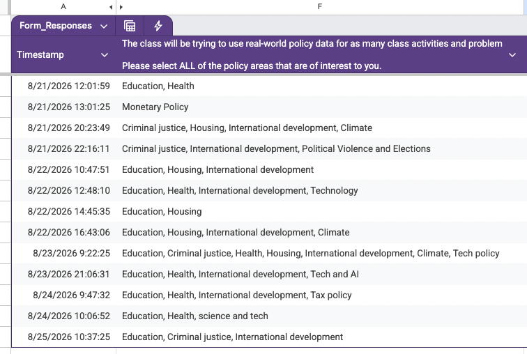
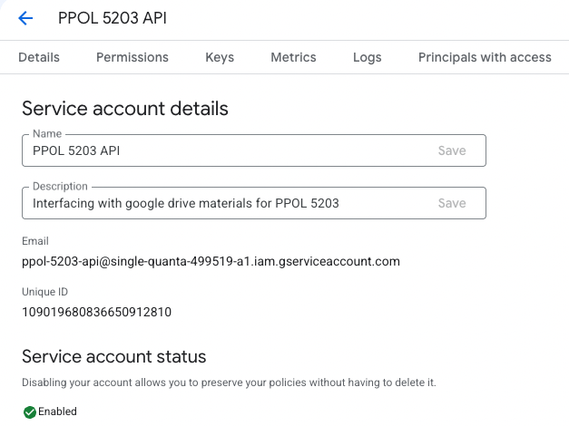
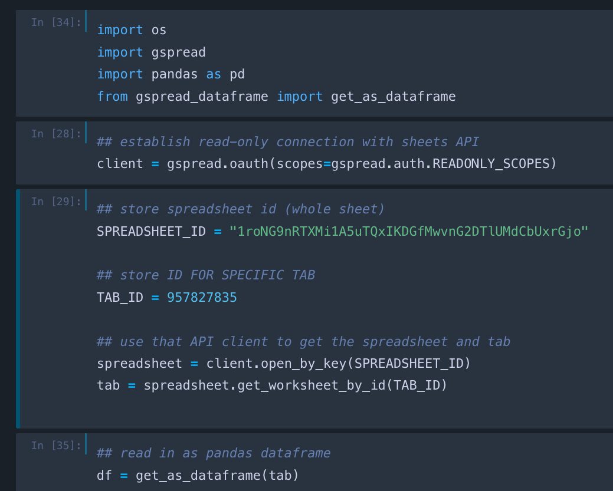
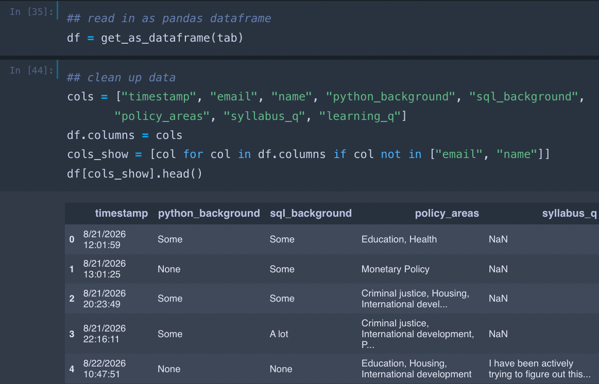
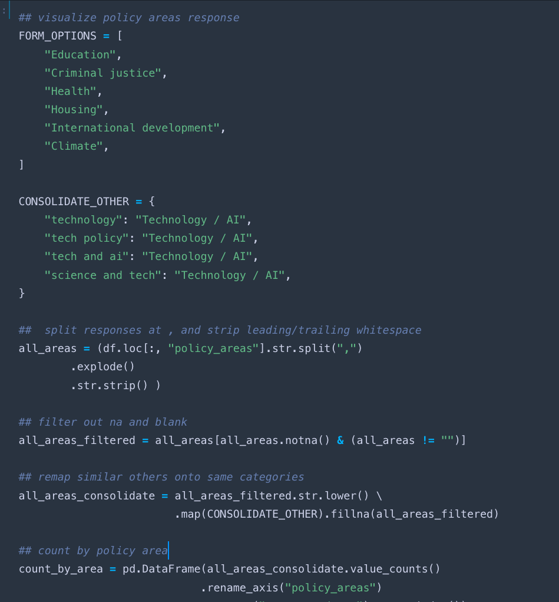
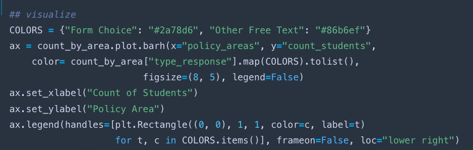
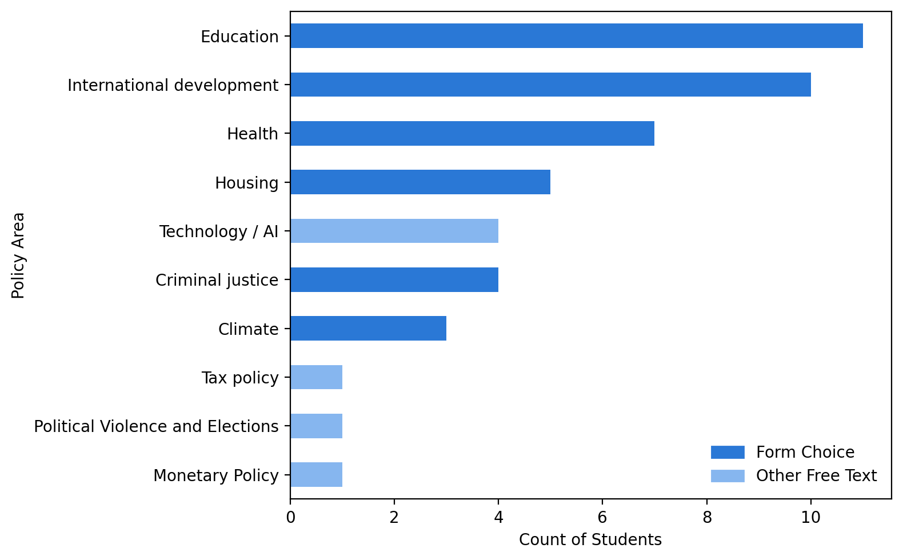

# Welcome to Data Science I {background-color="#447099"}

## Plans for Today

-   Motivating [Data Science for Public Policy]{.blue}.

-   Goals of the course

-   Introductions

-   Course Logistics

-   IDEs

    -   Jupyter

-   Introduction to command line

# Motivation: Digital Information Age {background-color="#447099"}

## Abundance of data

```{r  echo=FALSE, out.width = "80%", fig.align="center"}
knitr::include_graphics("week1_figs/digital.jpeg") 
```

## Powerful and Cheap Computing Power

```{r  echo=FALSE, out.width = "80%", fig.align="center"}
knitr::include_graphics("week1_figs/collab.png") 
```

## World of Generative AI Models

```{r  echo=FALSE, out.width = "80%", fig.align="center"}
knitr::include_graphics("https://diplo-media.s3.eu-central-1.amazonaws.com/2025/03/openai-chatgpt-surge-deepseek.jpg") 
```

## As a consequence, we live in a world:

::: nonincremental
::: fragment
-   **With** abundance of data we can use for research and to recommend policy decisions:

    -   Internet data, social media, geo-tracking tools, etc...
:::

::: fragment
-   **With** easily available technologies to analyze this data at scale

    -   Your laptops, cloud computing, ChatBots...
:::

::: fragment
-   **But** with new technologies that also have novel social implications:

    -   Privacy issues

    -   Use of technology by bad actors.

    -   Use of technology by governments to censor/monitor citizens.
:::

::: fragment
-   Policy scholars (but pretty much any researcher) need to be equipped to properly **work** with this data and **understand** the effects of these news technologies
:::
:::

## Data Science for Public Policy

**Data Scientist for Public Policy** focuses on **computational approaches** to solve/understand **policy problems**.

-   It is part of a larger and new field called [computational social science](https://en.wikipedia.org/wiki/Computational_social_science)

::: nonincremental
::: fragment
-   **Social science**

    -   Understands human behavior: human psychology, language, economic behavior, political systems, policy problems
    -   Involve many **approaches**: qualitative interviews, statistical analysis, simulations
:::

::: fragment
-   **Data Science**:

    -   Tools to work with large-scale data + learning models + novel data sources
:::
:::

# Computational Social Science in Practice

## Turning the intro survey into usable data

```{r  echo=FALSE, out.width = "80%", fig.align="center"}
 
```

## Step 1: Get credentials for APIs for Google Drive and Google Sheets

```{r  echo=FALSE, out.width = "80%", fig.align="center"}
 
```

## Step 2: Use those credentials in Python code to pull the data 

```{r  echo=FALSE, out.width = "80%", fig.align="center"}
 
```

## Step 3: clean data and view the head

```{r  echo=FALSE, out.width = "80%", fig.align="center"}
 
```

## Step 4: preprocess to visualize responses to policy question 

```{r  echo=FALSE, out.width = "80%", fig.align="center"}
 
```


## Step 5: plotting code 

```{r  echo=FALSE, out.width = "80%", fig.align="center"}
 
```


## Step 6: result

```{r  echo=FALSE, out.width = "70%", fig.align="center"}
 
```


## Goals of the course

<br>

The goal of this course is to teach you:

-   **Computational thinking**: how to approach problems and devise solutions from a computational perspective.

-   Get you started on **Python**, introduce some useful tools (scrapping, text analysis and API applications of GenAI models), and bit of **SQL** for applied data science; lay the foundations for the remainder of the core DS sequence

-   **Workflows and tools:** Git/GitHub + command line

# PPOL 5203 - Data Science I: Foundations {background-color="#447099"}

## Course Schedule {style="font-size: .7em;"}

| Week    | Topic                                                                             | Date               |
|------------------------|------------------------|------------------------|
| Week 01 | Introduction, Installations, IDEs, Command line                                   | August 27, 2026    |
| Week 02 | Version Control, Workflow and Reproducibility: Or a bit of Git & GitHub           | September 3, 2026  |
| Week 03 | Intro to Python - OOP, Data Types, Control Statements and Functions               | September 10, 2026 |
| Week 04 | Intro to Python II: Scaling up your code - Iteration, Comprehension and Functions | September 17, 2026 |
| Week 05 | From Nested lists to Dataframes: Numpy and Intro to Pandas                        | September 24, 2026 |
| Week 06 | Pandas II: Data Wrangling                                                         | October 1, 2026    |
| Week 07 | Joining, Tidying and Visualizing Data                                             | October 8, 2026    |
| Week 08 | Scraping + APIs                                                                   | October 15, 2026   |
| Week 09 | Statistical Learning                                                              | October 22, 2026   |
| Week 10 | Text as Data I: Discovery and Topics                                              | October 29, 2026   |
| Week 11 | Text as Data II: Supervised Learning                                              | November 5, 2026   |
| Week 12 | Generative AI                                                                     | November 12, 2026  |
| Week 13 | SQL                                                                               | November 19, 2026  |
| Week 14 | Presentations of Final Projects                                                   | December 03, 2026  |


# Introductions

## 

::: nonincremental
::: fragment
**Professor Rebecca Johnson**

-   Assistant Professor at McCourt School.
-   Demography, Sociology, and Social Policy PhD
-   Previously an Assistant Professor at Dartmouth College, teaching in their major in Quantitative Social Science
:::

::: fragment
**My Research: How social service agencies use a mix of data and discretion to allocate scarce resources:**

- Ranking of categories (e.g., disability; veteran) on waitlists for housing vouchers
- Parent perceptions of the fairness of using predictive modeling to determine which students need help most urgently versus older methods (e.g., income thresholds; counselor discretion)
- Database of K-12 school board meetings

:::

:::


## Your turn!

-   Name

-   (Briefly) what you were up to prior to the DSPP

-   If you could have any data source at your disposal, what would it be?

## Logistics {.center}

::: incremental
-   **Communication**: via slack. Join the [workspace!](https://compethicslawlabgu.slack.com/archives/C0BRR7LGB8U)

-   **All materials**: hosted on the class website: <https://rebeccajohnson88.github.io/PPOL5203_fall2026/>

-   **Syllabus**: also on the website.

-   **My Office Hours**: Wednesdays 11:30AM-1:30PM. Sign up on Calendly

-   **Canvas**: Only for official communication! Materials will be hosted in the website

-   **Datacamp**: Additional exercises (not graded). Access our free account [here](https://www.datacamp.com/groups/shared_links/63a4d32b3c706ed0a6fdb79245c95f84c9487b004a29163f4cc34e8331c3eec9)

-   **Task:** go on slack and send me a message about the data source you choose in the last answer, and if you feel comfortable add a picture to your profile

```{r}
library(countdown)
countdown(minutes = 5, seconds = 0, 
          right = 0, , top=0, 
          font_size = "2em")
```
:::


## Evaluation

| **Assignment**           | **Percentage of Grade** |
|--------------------------|:-----------------------:|
| Participation/Attendance |           5%            |
| Coding Discussion        |           5%            |
| Problem Sets             |           35%           |
| In-class Python Exam     |           15%           |
| Final Project            |           40%           |

## Problem Sets

Individual submission through GitHub.

| Assignment | Date Assigned |             Date Due             |
|:----------:|:-------------:|:--------------------------------:|
|   No. 1    |    Week 2     |  Before EOD of Friday of Week 3  |
|   No. 2    |    Week 4     |  Before EOD of Friday of Week 5  |
|   No. 3    |    Week 6     |  Before EOD of Friday of Week 7  |
|   No. 4    |    week 8     |  Before EOD of Friday of Week 9  |
|   No. 5    |  November 10  | Before EOD of Friday of Week 111 |

# [EOD = 11:59pm!]{.red}

## Final Project

-   You will work on in **groups!**

-   The project is composed of three parts:

    -   a 2 page project proposal: (which should be discussed and approved by me)
    -   an in-class presentation,
    -   A 10-page project report.

## Due dates and Points:

| **Requirement**  | **Due**     | **Length**    | **Percentage** |
|------------------|-------------|---------------|----------------|
| Project Proposal | October 31  | 2 pages       | 5%             |
| Presentation     | December 09 | 10-15 minutes | 10%            |
| Project Report   | December 16 | 10 pages      | 25%            |

## GenAI

You are allowed to use GenAI as you would use google in this class. This means:

-   Do not copy the responses from GenAI Chatbots -- a lot of them are wrong or will just not run on your computer

-   Use GenAI Chatbots as a auxiliary source.

-   If your entire homework comes straight from GenAI Chatbots, I will consider it plagiarism.

-   If you use GenAI Chatbots, I ask you to mention on your code how chatgpt worked for you.

-   I will be transparent about my own use of GenAI (e.g. to aid in grading)

## In-class Python Exam

This will take place after the Python content (after week 11). This will be a short exam, either using pen or paper or on a computer without accessing LLMs. It will be easy to complete if you have engaged with the content. 

# Let's take a break!

```{r}
library(countdown)
countdown(minutes = 10, seconds = 0, 
          left = 0, right = 0,
          top=0,
          padding = "100px",
          margin = "10%",
          font_size = "6em")
```

# `r fontawesome::fa("book-open")` Survey Results

## Summary of the survey

-   About half of you have **some** experience with Python.

-   Less exposure to SQL 


## Open Ended

Some of you are slightly anxious about Python and the pace of the class

::: incremental
-   The goal of the class is to bring everyone up to the same level of working Python proficiency

-   That means some content will be review for some of you and I appreciate you helping out your classmates

-   **Our approach**: We will start slow and build up from Python fundamentals -- so learning about the building blocks of dataframes before we actually work with data
:::

# `r fontawesome::fa("laptop-code")` Transition: Setting up Course Tools!

## Set up your course infra-structure

[See Course Website](https://rebeccajohnson88.github.io/PPOL5203_fall2026/course_infrastructure.html)

-   Install Python

-   Install Jupyter

-   Setup your Git/GitHub account

    -   Homework: Try to make one successful Git push before class next week.

## Jupyter:

[Jupyter Notebook Tutorial in the Class Website](https://rebeccajohnson88.github.io/PPOL5203_fall2026/lecture_notes/week-1/_using_jupyter_notebooks.html)

**Note on my approach on Notebooks:** I will go over quite quickly through the notebooks. You should run them by yourselves at a later point!

## Command Line

[Command Line Tutorial in the Class Website](https://rebeccajohnson88.github.io/PPOL5203_fall2026/lecture_notes/week-1/_basics_of_cmd.html)

## Datacamp Course

-   Join our team
-   Manipulating files and directories in  [Introduction to Shell](https://app.datacamp.com/learn/courses/introduction-to-shell)

## Additional Materials: Quarto

Totally optional to use! 

[Quarto tutorial on class website](https://rebeccajohnson88.github.io/PPOL5203_fall2026/lecture_notes/week-1/intro_to_quarto.html)

# See you next week!
