# Plans for Today {background-color="#447099"}

-   Course logistics 

-   Motivation for version control

-   Git and GitHub 

-   In-class activity to prep for pset 1


# Motivation

## Workflow and reproducibility

```{r  echo=FALSE, out.width = "80%", fig.align="center"}
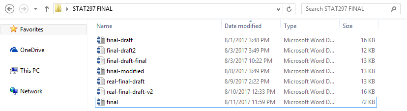 
```

# Git and GitHub

## What is Git?

-  Set of command line tools for version control (aka avoid finalfinal, finalrealthistime, etc.)
-  ``Distributed,'' or means that files/code, rather than only stored one place centrally, can be stored on all collaborators' machines

## What is GitHub?

- Web-based repository for code that utilizes \texttt{git} version control system (VCS) for tracking changes
-  Has additional features useful for collaboration, some of which we'll review today (repos; issues; push/pulling recent changes) and others of which we'll review as the course progresses (branches; pull requests)
-  Why GitHub rather than Dropbox/Google Drive?
    -  Explicit features that help with simultaneous editing of the same file
    - Public-facing record, or a portfolio of code/work (if you make it public)
    -  Ways to comment on and have discussions about code specifically through the interface

## Example repo: private repo

```{r  echo=FALSE, out.width = "80%", fig.align="center"}
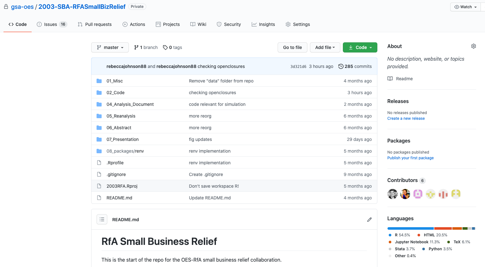 
```


If you go to the url, get 404 error unless you're added as a collaborator: [https://github.com/gsa-oes/2003-SBA-RFASmallBizRelief](https://github.com/gsa-oes/2003-SBA-RFASmallBizRelie)

## Example: tracked changes in code when you ``push'' updated version

```{r  echo=FALSE, out.width = "80%", fig.align="center"}
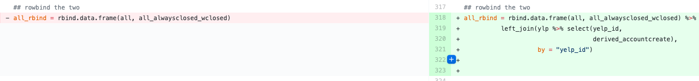 
```

## Example repo: public repo

Look familiar? [https://github.com/rebeccajohnson88/PPOL5203_fall2026](https://github.com/rebeccajohnson88/PPOL5203_fall2026)

## Ingredients of a repo: README

Should be more informative than the one for our class repo, e.g.:

```{r  echo=FALSE, out.width = "80%", fig.align="center"}
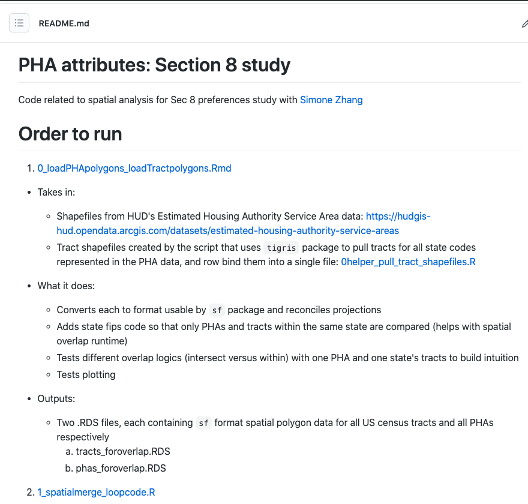 
```

Might have installation instructions, directions on where to download data, etc.

## Ingredients of a repo: files and directories

Command line commands we reviewed last week are useful for organizing and reorganizing repos. Example directory structure:

```   
├── /data
│   ├── /raw      
│   ├── /processed  
├── /docs 
├── /code
|   |── 01_clean_xxx.py
|   |── 01_analysis_xxx.py

├── /literature      

├── /output      
│   ├── /tables      
│   ├── /figures  
├── /misc 
└── readme.txt    
```   

## For these files and directories


- File names should be meaningful

- DO NOT USE SPACES. Use snake case (_) style for you files and code 

- Also allows you to avoid capitalization (`FileName` &rarr; `file_name`)

<br>

::: {.fragment}

> `data analysis 2.py` &rarr;  `data_analysis_2.py`

:::

<br>

::: {.fragment}

> `model_analysis.py` &rarr; `model_analysis_het_treatment_effects_main_paper.py`

:::


## Ingredients of a repo: data?

Depending on the context, you \textit{may} store data, but 

- GitHub has file size limits (though can pay to override these)
- Sensitive data should generally not be put in a repo, even if the repo is private since employees at the company have access to private repo content 
- Instead, read directly directly from its source or have download instructions

## Ingredients of a repo: issues

- Can assign to specific collaborators or leave as a "note to self" to look back at something
- Can use checklist features
-  Can include code excerpts
-  Easy to link to a specific commit (change to code)
-  Need to be logged into GitHub to write
    
```{r  echo=FALSE, out.width = "80%", fig.align="center"}
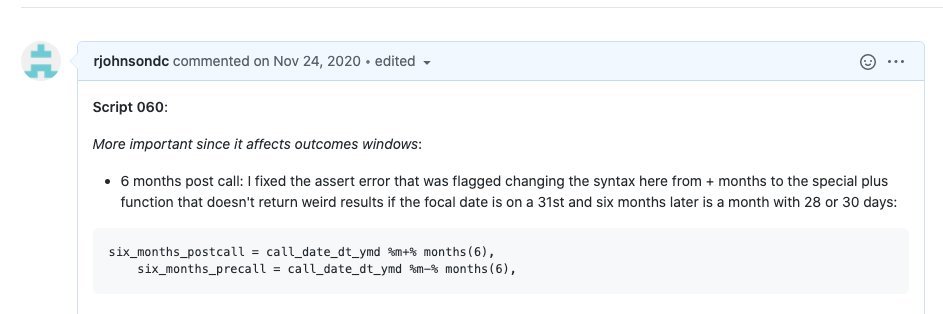 
```

## General steps in workflow

1. Either **create a repository locally** and link to GitHub OR **create a repository on GitHub** and clone
2. **Make changes** to code or other files
3. **Add changes**: tells the computer to move changes to a temporary staging area
3. **Commit changes**: tells the computer to ``save'' those staged changes, taking a permanent snapshot of what the changes are
4. **Push changes**: tells the computer to push those saved changes to GitHub (if file exists already, will overwrite file, but all previous versions of that file are accessible/retrievable)


## Step one: two paths to getting started

1. **Create a repository locally** and then **link it to GitHub**: use when you have an existing folder/set of files and you want to move it to git/GitHub-based version control

2. **Create a repository on GitHub** and then **create a linked copy locally**: my preferred way when starting a new project; what you'll do for problem sets


## Step one path one: linking a local directory to git/GitHub

Create an empty directory called `gitexample`  

```{python}
#| eval: false 
# check where you are
pwd 
# create dir
mkdir gitexample
# change cd
cd gitexample
```

Check if you have a git

```{python}
#| eval: false 
git --version
```

Start a repository within `gitexample`

```{python}
#| eval: false 
git init
```

## What you should see after git init

```{r  echo=FALSE, out.width = "80%", fig.align="center"}
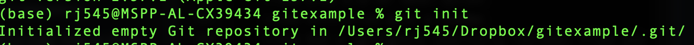 
```

Modify the contents of the directory by adding an (empty) README

```{python}
#| eval: false 
touch README.md
```

List files to make sure it was added

```{python}
#| eval: false 
ls
```


## Step one path one: linking a local directory to git/GitHub

Three steps:

1. `git add`: prepares the changes you made locally to be "sent up" to the repository. Can repeat many times as you work.

2. `git commit`: permanently saves those changes to your local history but doesn't yet send them to the remote repository for permanent record

3. `git push`: uploads the changes you made locally to the remote repository 

## Add versus commit versus push visualization

```{r  echo=FALSE, out.width = "80%", fig.align="center"}
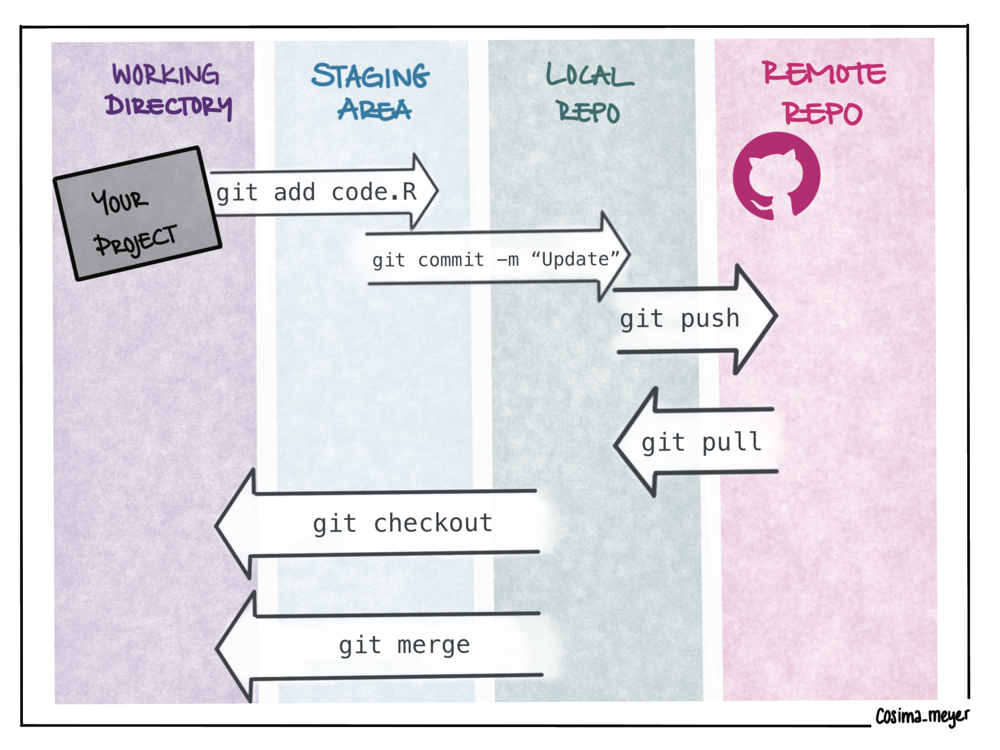 
```


[Source](https://cosimameyer.com/post/git-the-perks-of-collaboration-and-version-control/)

## Implementing in practice 

Add the file 

```{python}
#| eval: false 
git add README.md
```

First commit

```{python}
#| eval: false 
git commit -m "add readme"
```

Check your log

```{python}
#| eval: false 
git log
```

## How can we link these local changes to our remote GitHub account?

Easiest way: set up an empty repository on GitHub. To avoid errors, do not initialize the new repository with README, license, or gitignore files. 

[How to](https://docs.github.com/en/repositories/creating-and-managing-repositories/creating-a-new-repository)


## Once we have the link, following steps 

Tell it the url for the repository (will differ for you)

```{python}
#| eval: false 
git remote add origin https://github.com/rebeccajohnson88/gitexample.git

```

Push

```{python}
#| eval: false 
git push -u origin main

```

Should see it appear on your GitHub profile

```{r  echo=FALSE, out.width = "80%", fig.align="center"}
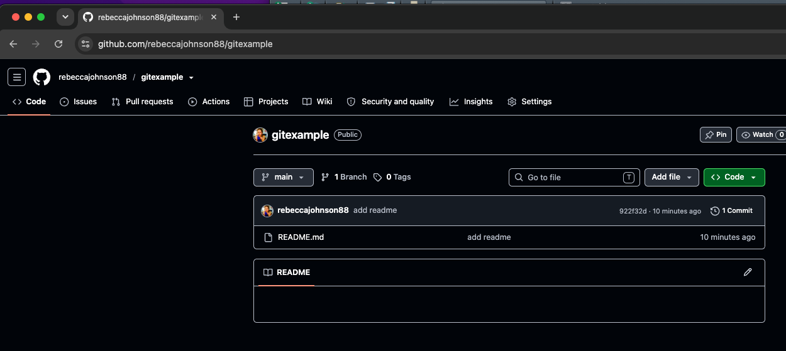 
```

## If you run into an issue at the push step, configuring your identity

```{python}
#| eval: false 
git config --global user.name "Your Name" 
git config --global user.email "your-email@example.com"
```


## If you run into an issue at the push step, configuring personal access tokens

1. Go to settings on right hand side under your profile 

```{r  echo=FALSE, out.width = "20%", fig.align="center"}
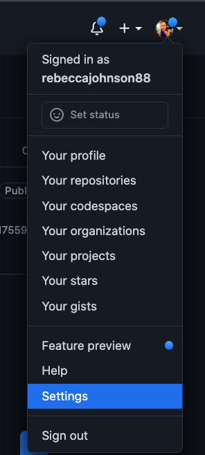 
```

## If you run into an issue at the push step, configuring personal access tokens

2. Scroll down to "Developer settings" on left hand side

```{r  echo=FALSE, out.width = "30%", fig.align="center"}
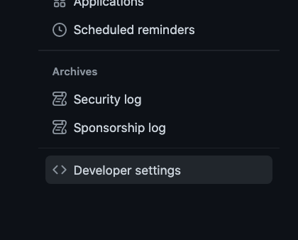 
```

## If you run into an issue at the push step, configuring personal access tokens

3. Click on personal access token and generate a personal access token

```{r  echo=FALSE, out.width = "30%", fig.align="center"}
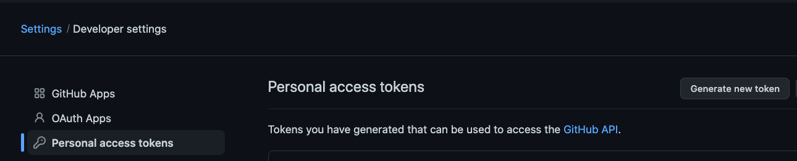 
```


## Putting it all together and your own practice

```{python}
#| eval: false 
mkdir gitexample
git init 
touch README.md
git add README.md
git commit -m "add readme"
git remote add origin YOUR_URL.git
git push -u origin main
```

Activity:

- Complete the above steps
- After you're done with the above steps, open jupyter notebook and create a new notebook called `notebook.ipynb` with some small amount of content
- Complete the following steps to push that code to your remote repository 

```{python}
#| eval: false 
git add notebook.ipynb
git commit -m "add code"
git push 
```

## Returning to the GitHub workflow steps

1. Either:
  - ~~Create a repository locally and link to GitHub~~ 
  - **Create a repository on GitHub** and clone
2. **Make changes** to code or other files
3. **Commit changes**: tells the computer to ``save'' the changes
4. **Push changes**: tells the computer to push those saved changes to GitHub (if file exists already, will overwrite file, but all previous versions of that file are accessible/retrievable)

## Cloning a repo

-  Open your local terminal and navigate to where you want the repo's files to be stored
-  Go to GitHub.com and create the repo; recommend include a README and a Python .gitignore file
- Go to the green  "Code" button to find the name of the repo
- In your terminal, use the following command to clone

```{python}
#| eval: false 
git clone reponame.git
```

## Once it's cloned, same process as earlier

- Edit files locally 
- Either add specific files, e.g.:

```{python}
#| eval: false 
git add notebook.ipynb
git commit -m "add code"
git push 
```

- Or add all changes 

```{python}
#| eval: false 
git add .
git commit -m "add all contents"
git push 
```

## Activity: clone a repo from our GitHub classroom page

[Access the activity here](https://classroom50.org/ppol5203-fall2026/ppol-5203-fall-2026/assignments/week-2-in-class-activity/accept)

Also linked here: TODO ADD LINK TO WEEK PAGE

## Pulling remote changes

- Within your `ppol5203_f26_activities` repo, make a change locally (e.g., adding a comment to the code)
- Try pushing (add, commit, push) the changes
- If you edited the README remotely, you likely get an error that updates were rejected before the remote contains work that you do not have locally

## How to address: ALWAYS pull before making local changes

```{python}
#| eval: false 
git pull
```

Either:
- There are no merge conflicts with the pull (the things you edited locally don't conflict with what you edited on the GitHub website) -> you can proceed with git push
- There are merge conflicts with the pull 

## What to do in the case of merge conflicts

- Open your text editor and navigate to the file that has merge conflicts (can use `vim` or other command line editor)

- Solve the conflict and delete the conflict markers

- Stage your changes (git add)

- Commit your changes (git commit)

## Activity 2

See activity 2 in your notebook 

## Activity 3

Cloning the repo with your problem set


