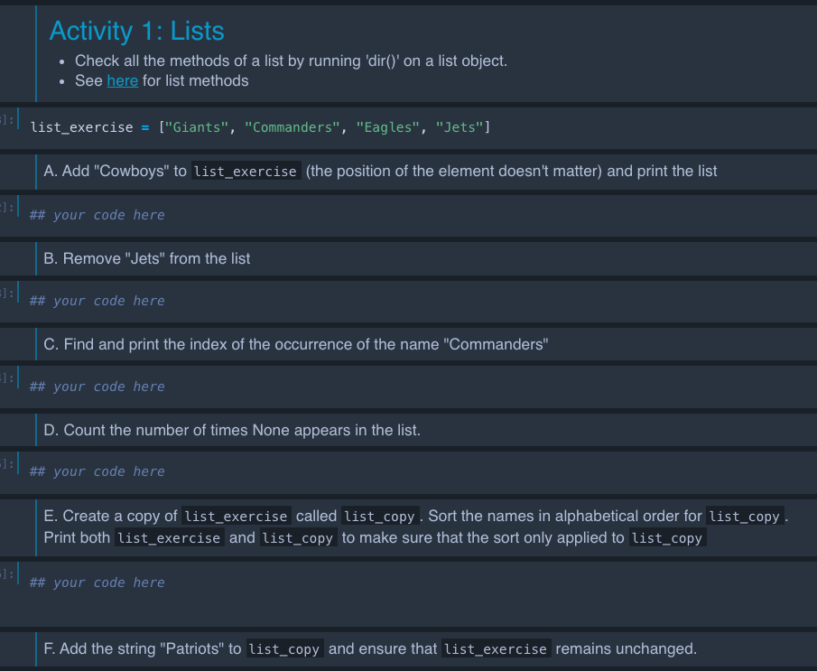
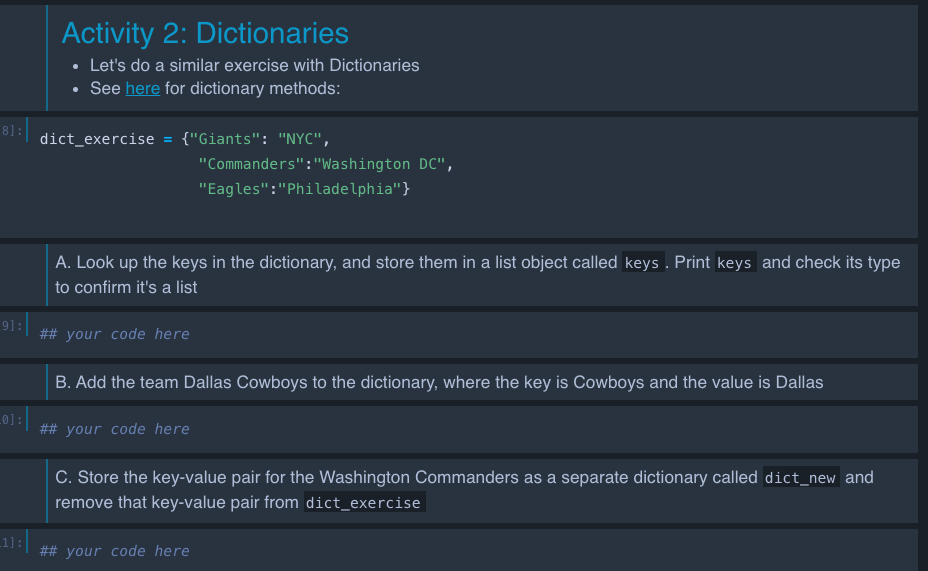
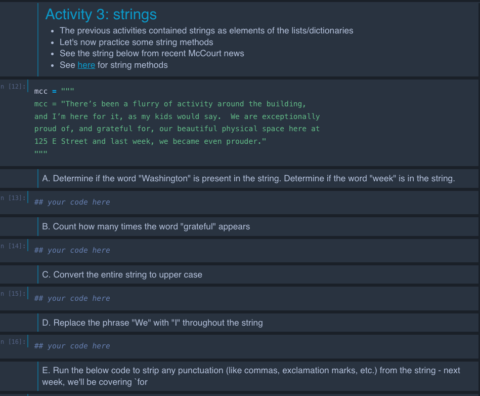
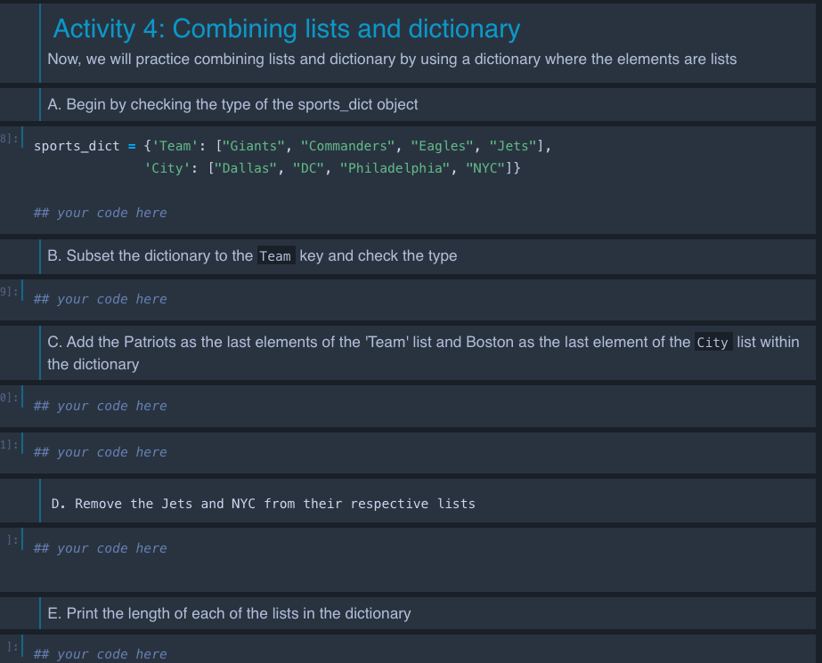

## Plans for Today

-   Short activity in problem set 1 repo

-   Introduction to Python

    -   Python as an Object-Oriented Programming Language

    -   Data Types in Python
    
-  Activity 

# Problem Set 1 Activity {background-color="#447099"}

## Problem Set 1 Activity

- Navigate to the cloned repo for problem set 1. This will be named something like `ppol-5203-fall-2026-problem-set-1-yourgithubusername`

- If you haven't already, use `mkdir` to create a folder in the repo called: `question-01`

- Use `touch` (Mac), `New-Item` (powershell), or another command to make a filed in the `question-01` directory called `main.py`

- Use the following steps to push your changes to your repo (if you've already pushed no need to redo):


```{python}
#| eval: false 
git add question-01/
git commit -m "pushing the q1 directory"
git push 
```

**Note**: this will be where you make the files / directories we ask you to make for Question 1. 


## Am I able to see your changes?

During our break/after class, I'll fill out the "PS1 check" column on this GitHub usernames sheet: [usernames](https://docs.google.com/spreadsheets/d/1vMIFgJej0SAY8_BfCmaXcAGl_pgZcAJehhV9WdPHWas/edit?usp=sharing)

## Prep for me deleting Classroom 50 activities repo

- After class, I'll be deleting the public repos called `ppol-5203-fall-2026-week-2-in-class-activity-yourusername` from our organization so that you/we have a more streamlined set of repos to view 

- If you have content in there you want to preserve, move it to your personal `ppol5203_f26_myactivities` repo 


# Introduction to Python {background-color="#447099"}

## Python: Object-Oriented Programming Language

In most Python introductions out there, you would start with:

-   Python as a calculator

-   Data Types in Python

-   Objects

::: fragment
**We will take a different route starting with a brief overview of object-oriented programming**
:::

## Object-oriented programming (OOP) vs Functional Programming Language

-   **Python** is an object-oriented programming language (OOP).

    -   Key concept: it uses "objects" that contains data and methods (functions).

-   **R** is a functional programming language

    -   Key concept: treats functions as the first-class citizens, meaning they can be assigned to variables, passed as arguments, and returned by other functions

## 

#### Python OOP

```{python}
#| eval: false

# call library
import pandas as pd

# Using a Pandas Series method (OOP)
s = pd.Series([1, 2, 3, 4, 5])

# create a series object. You use a methods from this object to take the mean
s.mean()

```

<br>

#### R Functional Programming in Practice

```{python}
#| eval: false
vec <- c(1, 2, 3, 4, 5)
mean(vec)
```

-   Objects are the core of Python.
-   From the objects, you will access functions that will make Python work.
-   You can also access data from object.

## 

### Basics: Creating an object in Python.

`=` is the assignment operator in Python. (Different from the `<-` in R)

```{python}
x = 4
```

## What happens upon assignment?

::: fragment
**Action 1:** A reference is assigned to an object, with an id number in memory

```{python}
id(x)
```
:::

## 

**Action 2** An object type (class) is defined at run time

```{python}
type(x)
```

## 

**Action 3:** Object's class is instantiated upon assignment. An object is an **instance** of a particular class.

```{python}
# what is the class?
type(x)

```

```{python}
# Access methods (behaviors) using .
x.bit_length()
```

```{python}
# see all methods
dir(x)
```

## Object-Oriented Programming: What are these classes?

::: incremental
-   **Instantiation:** When we create a object, we are creating an instance of this class.

-   **Inheritance:** Every time we create an object, the objects inherits a class.

    -   **A class** is a blueprint holding of the properties of a particular data structure.

    -   **An instance** is a realization of a particular class. This instance inherits the characteristics of its class.

-   **Components:** Classes have two major components:

    -   **Attributes:** these are constant features, data, a characteristic of the broader class. For instance, many objects have some sort of length attribute.

    -   **Methods:** these are actions, behaviors of this class. For instance, you might have a  mean or median method you can apply to an object.

-   **Polymorphism:** Both attributes and methods are accessed through `.` function, conditional on the class
:::

## 

### Create a Class

```{python}
class Example():
  def __init__ (self, name):
    self.name = name
  def hello(self):
    print('Hi, I am ' + self.name)
```

## 

### Instantiate

```{python}
# Instatiate
me = Example(name="Rebecca")
type(me)
```

## 

### Attributes

```{python}
me.name
```

## 

### method

```{python}
me.hello() 
```

# Data types

## Data Type

Python comes with a number of built-in data types. Two major data type groups in Python:

-   **Scalar types**: hold one piece of information, like a digit.

-   **Collection types**: hold multiple pieces of information

There are two ways of instantiating a data class in Python:

-   **Literals:** syntactic representation in Python, e.g. \[\]

-   **Constructors:** class constructors, e.g. list()

## Scalar

| *Type* | *Description* | *Example* | *Literal* | *Constructor* |
|:------------:|:----------------|:------------:|:------------:|:------------:|
| `int` | integer types | `4` | `x = 4` | `int(4)` |
| `float` | 64-bit floating point numbers | `4.567` | `x = 4.567` | `float(4.567)` |
| `bool` | boolean logical values | `True` | `x = True` | `bool(1)` |
| `None` | null object (serves as a valuable place holder) | `None` | `x = None` |  |

## Collectors {.smaller}

| *Type* | *Description* | *Example* | *Mutable* | *Literal* | *Constructor* |
|:----------:|:-----------|:----------:|:----------:|:----------:|:----------:|
| `list` | heterogeneous sequences of objects | `[1,"2",True]` | ✓ | `x = ["c","a","t"]` | `x = list("cat")` |
| `str` | sequences of characters | `"A word"` | ✘ | `x = "12345"` | `x = str(12345)` |
| `tuples` | heterogeneous sequence of objects | `(1,2)` | ✘ | `x = (1,2)` | `x = tuple([1,2])` |
| `sets` | unordered collection of *distinct* objects | `{1,2}` | ✓ | `x = {1,2}` | `x = set([1,2])` |
| `dicts` | associative array of key/value mappings | `{"a": 1}` | keys ✘<br>values ✓ | `x = {'a':1}` | `x = dict(a = 1)` |


# In-class Activity

## Where to download

- On this [week page](/weeks/week-03.qmd)
- We'll pause after each activity and go over solutions

## Activity 1

{width="80%" fig-align="center"}

## Activity 2

{width="80%" fig-align="center"}

## Activity 3 

{width="80%" fig-align="center"}

## Activity 4

{width="80%" fig-align="center"}

# See you next week! {background-color="#447099"}

