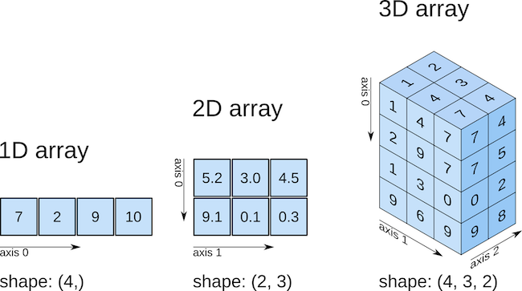
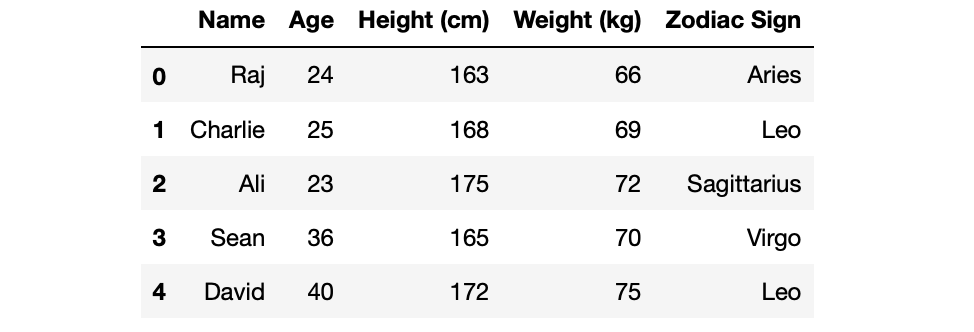

# Plans for Today

-   Importing libraries and data in Python

-   Data as nested lists

-   Numpy 

-   Activity: starting on problem set 2


# Libraries and Importing Data {background-color="#447099"}

## Importing libraries in Python

::: incremental

-   Python allows you to import libraries in a few different ways:

    -   The full library with the original name

    -   The full library with an alias

    -   Some functions from the library

    -   All methods from the library as independent functions
:::

## The full library and its functions

<br>

```{python}
# import library
import math

# access methods from the library
math.pi
```

<br>

```{python}
# this will throw you an error
pi
```

## The full library with an alias

<br>

```{python}
# import library
import math as m

# access methods from the library
m.pi
m.factorial(5)

```

## Some functions from the library

<br>

```{python}
# import some functions
from math import pi

# run
pi
```

## All methods from the library as independent functions

```{python}
# all methods as independent functions
from math import *

# run
factorial(5)
```

## Reading files in Python

-   **open()**: opens a **connection** with files on our system.

    -   **open()** returns a special item type \*\_io.TextIOWrapper\*
    -   This item is a iterator. We need to go through to convert inputs to a object in python.

-   **close()**: closes the connection.

-   **write()**: writes files on your system. Also line by line, as in **open()**

-   **with()**: wrapper for open and close that allows alias.

## Example: csv file 

```{python}
# Libraries 
import csv
import os

# Print current working directory
os.getcwd()

# List files in datasets directory
os.listdir("../datasets/")

# Load gapminder dataset
with open("../datasets/gapminder.csv",mode="rt") as file:
    data = [row for row in csv.reader(file)]


```


# Data as Nested Lists {background-color="#447099"}

## Or motivating Numpy {visibility="hidden"}

So far, all our datatypes are geared towards kind of unidimensional data. We can get over with this using a nested list

We'll use the example we loaded in the previous slide


## Nested Lists: Bad data structure. Why?{visibility="hidden"}

```{python}
# let's see the data

print(data)

```

## Working with nested lists: indexing

Issue: python doesn't recognize the first element as a header

```{python}
data[0]


```

## Indexing by rows


```{python}

data[100]

```


## Indexing by columns


```{python}
one_row = data[100]
one_row
one_row[0]

```

## Combining indexing by rows and columns

```{python}

data[100][0]


```

## What if I want to be able to index the columns  by name?

Multi-step process

```{python}
## create a mapping of column names to col positions
name_cols = data.pop(0)
name_cols

## get index of a particular column name
country_index = name_cols.index("country")
country_index

## subset to value at that index
## (note, since we used pop our positions change, another
## drawback)
data[99][country_index]

```

## What if I want to pull all the values in a column?

Complicated process in the nested list structure 


```{python}
# Getting all the life expectancies (column 1)

life_exp = [float(row[1]) for row in data]
print(life_exp)
```


# Numpy {background-color="#447099"}

## Here comes numpy ...{visibility="hidden"}

<br>

{fig-align="center"}

::: aside
source: [Python Programming for Data Science](https://www.tomasbeuzen.com/python-programming-for-data-science/README.html)
:::

## Why should you learn? Holds Python together! {visibility="hidden"}

<br>

{fig-align="center"}
## Motivating Numpy

So far, all the data structures we saw are geared towards unidimensional data.

-   **string**: sequence of words

-   **list**: sequence of heterogeneous elements

-   **dictionaries**: key-value combinations.

## Tabular data

{fig-align="center"}


## Efficiency

-   Numpy leans toward less flexibility and more efficiency.

-   Lists gives you more flexibility and less efficiency.

-   Allows for easy vectorization of functions

-   Broadcasting for working with arrays with different dimensions

## Converting the nested list to a numpy array


```{python}
# Import numpy library; alias as np
import numpy as np

# Convert nested list to array
data_np = np.array(data)

# Print
data_np


```


## Preview: much easier indexing/subsetting 

Pulling out life expectancy 

```{python}
data_np[:, 1]

```

## Starting with simpler structures: creating an array from a list


```{python}
# from a list of int elements
np.array([1, 4, 2, 5, 3])

# you can specify the type
np.array([1, 2, 3, 4], dtype='int')

# unlike lists, NumPy arrays can explicitly be multidimensional
multi_array = np.array([range(i, i+3) for i in [2, 4, 6]])
multi_array

```

## One drawback of arrays compared to lists

```{python}
# lists support heterogenous data types. It needs to store this information somewhere for every element!
list_ =  ["beep", "false", False, 1, 1.2]
list_

# numpys only support homogenous data types. Stores elements and this information in a single place!
numpy_boolean = np.array([[True, 0], [True, "TRUE"], [False, True]], dtype=bool)
numpy_boolean
```

## Defaulting to strings in mixed use case if we don't define the data type

```{python}
# without define the datatyp
numpy_boolean = np.array([[True, 0], [True, "TRUE"], [False, True]])

# will create a string type
numpy_boolean


```

## Creating arrays not using lists

- Can also create arrays with certain content. Some examples:

```{python}
## creating a 3x3 array filled with 1s
np.ones((3,3))

## creating a 3x3 array filled with random numbers between 0 and 1
np.random.random((3, 3))

## creating a 3x3 array filled with random integers
## from a pre-defined interval (in this case, 1 through 10)
np.random.randint(1, 10, (3, 3))
```

## What are some attributes of arrays?

- `numpy.dim`: tells us the number of dimensions
- `numpy.shape`: tells us the size of each dimension
- `numpy.size`: tells us the full size of a array


```{python}

# generate an array
X = np.random.randint(0, 100, (5, 5))
X

# information
print("ndim: ", X.ndim)
print("shape:", X.shape)
print("size: ", X.size)

```

## Array indexing and slicing 

- Similar to list indexing but more flexibility as you go above 1 dimension

- In a one-dimensional array, you can access the ith value (**counting from zero**) by specifying the desired numerical index. 

```
M[element_index]
```

- For n-dimensional arrays, you can access elements with a tuple for row and column index. 

```
M[row, column]
```

You can use the `:` shortcut for slicing.

## Example indexing

```{python}
X
# index first row 
X[0] 

# index first column
X[:,0]

# index a specific cell 
X[0,0] 

# slice rows and columns
X[0:3,0:3] 

# last row
X[-1,:] 
```

## Reassignment

As we just saw, `numpy` makes your life easier for access elements on a rectangular type of data -- when compared to nested lists. 

In the same vein, `numpy` uses the benefits of its easy indexing scheme to facilitate reassignment of values. 


## Creating the base array


```{python}
# Create an array
X = np.zeros(50).reshape(10,5)
X
```


## Reassigning values by a single position vs. a range of values


```{python}
# Reassign data values by referencing positions
X[0,0] = 999
X

# Reassign whole ranges of values
## entire row
X[0,:] = 999
X

## entire column
X[:,0] = 999
X
```

## Reassignment based on conditional statements

```{python}
D = np.random.randn(50).reshape(10,5).round(1)
D

D[D > 0] = 1
print(D)


```

## Reassignment based on conditional statements

```{python}
D[D <=0 ] =0
print(D)


```


## np.where streamlines this conditional reassignment


```{python}
D = np.random.randn(50).reshape(10,5).round(1) # Generate some random numbers again
D # Before 
np.where(D>0,1,0) # After


```


## One warning with slicing and reassignment: need to explicitly copy array to avoid modifying original

```{python}
X = np.random.randint(0, 100, (1, 5))

# slice
X_sub = X[:3]

# modify
X_sub[0][0] = 3000

# print
print(X, X_sub)


```

## How to avoid: add an explicit copy


```{python}
X = np.random.randint(0, 100, (1, 5))

# slice.copy()
X_sub = X[:3].copy()

# modify
X_sub[0][0] = 1000

# print
print(X, X_sub)

```


## Concatenating and splitting arrays

- `np.concatenate([array,array],axis=0)`: concatenate by rows
- `np.concatenate([array,array],axis=1)`: concatenate by columns 

The same behavior can be achieved with:

- `np.vstack([array,array])`: concatenate by rows
- `np.hstack([m1,m2])`: concatenate by columns

## Example applications

```{python}
# create arrays
X = np.random.randint(0, 100, (5, 2))
Y = np.random.randint(0, 100, (5, 2))

X
Y

```

## Rowbind / vertically stack

```{python}
np.concatenate([X,Y],axis=0)


```

## Column bind / horizontally combine 


```{python}
# cbind
np.concatenate([X,Y],axis=1)


```

## Broadcasting 

- **Broadcasting** makes it possible for operations to be performed on arrays of mismatched shapes.

- Broadcasting describes how numpy treats arrays with different shapes during arithmetic operations. 
- Subject to certain constraints, the smaller array is "broadcast" across the larger array so that they have compatible shapes.


## Example: adding to an array

- A 5 x 1 array

$$ 
\begin{bmatrix} 1\\2\\3\\4\\5\end{bmatrix}
$$
$$ 
\begin{bmatrix} 1\\2\\3\\4\\5\end{bmatrix} + 5
$$

## Example: adding to an array

Broadcasting "pads" the array of 5 (which is shape = 1,1), and extends it so that it has similar dimension to the larger array in which the computation is being performed.

$$ 
\begin{bmatrix} 1\\2\\3\\4\\5\end{bmatrix} + \begin{bmatrix} 5\\\color{lightgrey}{5}\\\color{lightgrey}{5}\\\color{lightgrey}{5}\\\color{lightgrey}{5}\end{bmatrix}
$$

$$ 
\begin{bmatrix} 1 + 5\\2 + 5\\3 + 5\\4 + 5\\5 + 5\end{bmatrix} 
$$

$$ 
\begin{bmatrix} 6\\7\\8\\9\\10\end{bmatrix} 
$$

## How this works in Python


```{python}
A = np.array([1,2,3,4,5])
A + 5


```

## Where broadcasting works versus fails

What it does with a smaller array: If the shape of the two arrays does not match in any dimension, the array with shape equal to 1 in that dimension is stretched to match the other shape.


```{python}
larger = np.ones((3,3)) 
smaller = np.arange(3)
larger
smaller

```

Numpy expands the smaller array to:

$$
\begin{bmatrix} 0 & 1 & 2\\ \color{lightgrey}{0} & \color{lightgrey}{1} & \color{lightgrey}{2} \\  \color{lightgrey}{0} & \color{lightgrey}{1} & \color{lightgrey}{2}\end{bmatrix} 
$$
Resulting in:

```{python}
larger+smaller

```

## If the dimensions are incompatible even with expansion, throws an error

```{python}
M = np.ones((3, 2))
M

a = np.arange(3)
a

# (uncomment to see error)
# M+a 

```

## Summing up what we covered 

- Using libraries to expand capabilities beyond base Python: `os`, `csv`, `numpy`
- Using nested lists as a data structure: drawbacks
- Numpy arrays as a more flexible data structure
- Operations with numpy arrays:
  - Indexing and subsetting / slicing
  - Reassigning values within an array
  - Combining arrays by rows and columns
  - Using broadcasting rules for array math


# In-class Activity

## Work on Numpy questions in Problem Set 2

- Accept invitation to assignment
- Clone repo locally
- Open the problem set notebook