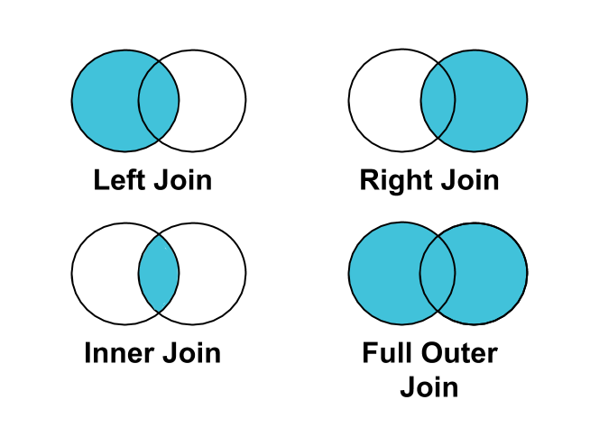

# Plans for Today

-   Data wrangling: reshaping

-   Data wrangling: merging

# Data wrangling: reshaping {background-color="#447099"}

## Two general formats for data

-   **Wide-format data**: each row is one unit (a person; a company; a state); columns contain time or type-varying information about that unit
-   **Long-format data**: each row is a snapshot of that unit (eg a person at one point in time; a state with one economic summary measure); each unit might have multiple rows; sometimes called "tidy" data format

## Examples

Wide format:

| Student | gpa_2020 | gpa_2021 | ncourses_2020 | ncourses_2021 |
|---------|----------|----------|---------------|---------------|
| 1       | 3.8      | 3.9      | 5             | 3             |
| 2       | 3.6      | 3.6      | 6             | 7             |

Long format:

| Student | year | stat     | value |
|---------|------|----------|-------|
| 1       | 2020 | gpa      | 3.8   |
| 1       | 2021 | ncourses | 3.9   |
| 1       | 2020 | gpa      | 5     |
| 1       | 2021 | ncourses | 3     |
| 2       | 2020 | gpa      | 3.6   |
| ...     |      |          |       |

## One direction of transformation: pivoting from long to wide

Syntax:

pd.pivot(longformat_df, 
    index= 'col_unitinfo',
    columns= 'col_repeatmeasure', 
    values = ['col1_value', 'col2_value', ...])
    
Breaking it down:

- **index**: the name of the column we want to treat as a row--- in the previous example, we want one student per row
- **values**: the name of the column(s) that contain the values of data we want to ``spread'' out --- in the previous example, we want the gpa and total courses information spread out
- **columns**: the name of the column(s) that describe the unit of variation --- in the previous example, the year column (2020 or 2021) and stat column (gpa or ncourses)

## Visualization of long to wide


## Other direction of transformation: ``melting'' from wide to long

Syntax:
pd.melt(wideformat_df, id_vars = 'nameofcol')

Breaking it down:

- **id_vars**: the name of the columns you're treating as the unit of analysis that has repeated measures
- See documentation here for optional arguments that help us rename the output: [melt documentation](https://pandas.pydata.org/docs/reference/api/pandas.melt.html)

## Visualization of wide to long


## In-class activity {background-color="#449998"}

See Activity 1 in notebook

# Data wrangling: merging {background-color="#447099"}

## Working example

- **Main or "left" dataset:** college data on students' high schools

| **Student** | **Year** | **District** | **NCES ID** |
|:---|:---|:---|:---|
| Rebecca | 2021 | New Trier High School | 1728200 |
| Jennifer | 2022 | Bethesda High | 3302670 |
| Jason | 2022 | Homeschool | NA |
| ⋮ | | | |

- **Auxiliary or "right" dataset** - FRPL = free or reduced price lunch eligible percentage; used as (one) measure of school district poverty

| **District** | **NCES ID** | **% FRPL** |
|:---|:---|:---|
| New Trier HS | 1728200 | X% |
| Bethesda HS | 3302670 | Y% |
| Arundel HS | 4107380 | Z% |
| ⋮ | | |

## Possible join keys

- **Unique identifier:** used for "exact matching" --- or a Yes/No match on that basis
  - E.g., is the NCES ID of New Trier found in the dataset of demographics?
- **Other identifiers:** can be used for either "exact match" or for "probabilistic/fuzzy matching"
  - **Probabilistic:** what's the likelihood that "New Trier district" and "New Trier HS" are the same entity?

## Conceptual overview of four types of joins

::: {style="text-align: center;"}
{width=55%}
:::

::: {style="text-align: right;"}
**Source:** Trifacta
:::

## Inner join in this context

**In words:** "drop all students whose districts don't appear in the demographics data; drop all districts that don't appear in the Georgetown student data"

- **Main or "left" dataset**

<table>
<tr><th><strong>Student</strong></th><th><strong>Year</strong></th><th><strong>District</strong></th><th><strong>NCES ID</strong></th></tr>
<tr><td>Rebecca</td><td>2021</td><td>New Trier High School</td><td>1728200</td></tr>
<tr><td>Jennifer</td><td>2022</td><td>Bethesda High</td><td>3302670</td></tr>
<tr style="background-color:#f8d7da;"><td>Jason</td><td>2022</td><td>Homeschool</td><td>NA</td></tr>
<tr><td>⋮</td><td></td><td></td><td></td></tr>
</table>

- **Auxiliary or "right" dataset**

<table>
<tr><th><strong>District</strong></th><th><strong>NCES ID</strong></th><th><strong>% FRPL</strong></th></tr>
<tr><td>New Trier HS</td><td>1728200</td><td>X%</td></tr>
<tr><td>Bethesda HS</td><td>3302670</td><td>Y%</td></tr>
<tr style="background-color:#f8d7da;"><td>Arundel HS</td><td>4107380</td><td>Z%</td></tr>
<tr><td>⋮</td><td></td><td></td></tr>
</table>

## Outer join in this context

**In words:** "keep all students from the student-level data; keep all schools from the school-level data; even if there's not an overlap"

| **Student** | **Year** | **District** | **NCES ID** | **% FRPL** |
|:---|:---|:---|:---|:---|
| Rebecca | 2021 | New Trier High School | 1728200 | X% |
| Jennifer | 2022 | Bethesda High | 3302670 | Y% |
| Jason | 2022 | Homeschool | NA | NA |
| NA | NA | NA | 4107380 | Z% |
| ⋮ | | | | |

## Left join in this context

**In words:** "keep all students from the student-level data; drop any school from the school-level data that doesn't merge onto a student"

- **Main or "left" dataset**

<table>
<tr><th><strong>Student</strong></th><th><strong>Year</strong></th><th><strong>District</strong></th><th><strong>NCES ID</strong></th></tr>
<tr><td>Rebecca</td><td>2021</td><td>New Trier High School</td><td>1728200</td></tr>
<tr><td>Jennifer</td><td>2022</td><td>Bethesda High</td><td>3302670</td></tr>
<tr style="background-color:#d4edda;"><td>Jason</td><td>2022</td><td>Homeschool</td><td>NA</td></tr>
<tr><td>⋮</td><td></td><td></td><td></td></tr>
</table>

- **Auxiliary or "right" dataset**

<table>
<tr><th><strong>District</strong></th><th><strong>NCES ID</strong></th><th><strong>% FRPL</strong></th></tr>
<tr><td>New Trier HS</td><td>1728200</td><td>X%</td></tr>
<tr><td>Bethesda HS</td><td>3302670</td><td>Y%</td></tr>
<tr style="background-color:#f8d7da;"><td>Arundel HS</td><td>4107380</td><td>Z%</td></tr>
<tr><td>⋮</td><td></td><td></td></tr>
</table>

## Right join in this context

**In words:** "drop students who don't have a school in the school-level data; keep all schools from the student-level data even those that don't merge onto any student"

- **Main or "left" dataset**

<table>
<tr><th><strong>Student</strong></th><th><strong>Year</strong></th><th><strong>District</strong></th><th><strong>NCES ID</strong></th></tr>
<tr><td>Rebecca</td><td>2021</td><td>New Trier High School</td><td>1728200</td></tr>
<tr><td>Jennifer</td><td>2022</td><td>Bethesda High</td><td>3302670</td></tr>
<tr style="background-color:#f8d7da;"><td>Jason</td><td>2022</td><td>Homeschool</td><td>NA</td></tr>
<tr><td>⋮</td><td></td><td></td><td></td></tr>
</table>

- **Auxiliary or "right" dataset**

<table>
<tr><th><strong>District</strong></th><th><strong>NCES ID</strong></th><th><strong>% FRPL</strong></th></tr>
<tr><td>New Trier HS</td><td>1728200</td><td>X%</td></tr>
<tr><td>Bethesda HS</td><td>3302670</td><td>Y%</td></tr>
<tr style="background-color:#d4edda;"><td>Arundel HS</td><td>4107380</td><td>Z%</td></tr>
<tr><td>⋮</td><td></td><td></td></tr>
</table>

## DataCamp versus slide syntax

- DataCamp modules generally used this syntax for merges:

```python
merged_df = df1.merge(df2,
                how = "left",
                on = "something")
```

- Slides/solution code will tend to use this syntax:

```python
merged_df = pd.merge(df1, df2,
                how = "left",
                on = "something")
```

- They produce identical answers so use whichever comes more naturally (I use latter because it's more similar to base `R` syntax)
- In addition, feel free to use self joins if useful but we won't be focusing a lot on those

## How do we code these different types of joins in practice? {.smaller}

### Example with left join and join key has same colname in both

```python
## perform a left join on the student data
## and schools data
stud_wschool = pd.merge(students,
                schools,
                how = "left",
                on = "NCES ID",
                indicator = "student_mergestatus")
```

- `how`: argument to tell it inner, left, right, outer, or cross; defaults to inner
- `on`: name of join key (in this case single key)
- `indicator`: optional arg to add a col to the resulting data (string is what to call it) that helps diagnose merge status; good for post-merge dx

## Example with inner join and join key has different name

```python
## perform a left join on the student data
## and schools data
stud_wschool = pd.merge(students,
                schools,
                how = "inner",
                left_on = "NCES ID",
                right_on = "ncesnumeric")
```

## Example with left join and multiple join keys

```python
## perform a left join on the student data
## and schools data
stud_wschool = pd.merge(students,
                schools,
                how = "left",
                left_on = ["NCES ID", 
                "Dist name"],
                right_on = ["ncesnumeric",
                "distnamechar"],
                indicator = "student_mergestatus")
```

## Example with left join, multiple join keys, and some overlapping, non-join columns that we want to differentiate {.smaller}

```python
## perform a left join on the student data
## and schools data
stud_wschool = pd.merge(students,
                schools,
                how = "left",
                left_on = ["NCES ID", 
                "Dist name"],
                right_on = ["ncesnumeric",
                "distnamechar"],
                indicator = "student_mergestatus",
                suffixes = ["_students",
                            "_schools"])
```

## Non-exhaustive checklist of merge diagnostics

1. How many rows were in each data before the merge? What about after?
2. If doing a left join, did we properly retain all left-hand side rows?
3. **For strings as join keys:** if a lot of rows were lost in a merge, could that be due to spelling/punctuation variations in a character join key?
4. **For numeric identifiers as join keys:** if a lot of rows were lost in a merge, could that be due to things like the id having leading or lagging zeros and those being stripped at some stage? (e.g., one dataset identifies an entity as `002548`; another as `2548`)


## In-class activity {background-color="#449998"}

See Activity 2 in notebook
